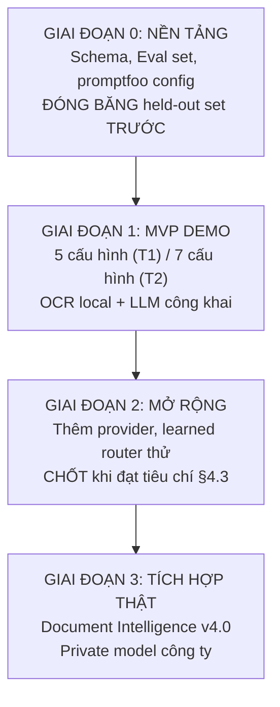

# OP5 — Kế hoạch tổng thể v2 (bản hợp nhất & cải thiện)

> **Nguồn:** Bài toán OP5 trong `doc/problem/OP5.md` (brief thực tập AI 2026 batch 2).
> **Sửa đổi so với v1:** Bám stack promptfoo + dự án 4 (Lê Trung Hiếu), tách Track 1/Track 2
> theo đòn bẩy riêng, bổ sung schema JSONL, chốt deterministic router, tách dev/test held-out,
> bổ sung tiêu chí dừng mở rộng, và định nghĩa metric cụ thể (TEDS, citation precision, refusal).

---

## 1. Mục tiêu & ràng buộc

- **Đích cuối:** pipeline tích hợp **Azure Document Intelligence v4.0** (OCR) + **private model API của công ty** (LLM), cho 2 track: trích xuất hợp đồng và RAG tra cứu hợp đồng.
- **Ràng buộc:** side-project, không dùng dữ liệu/hạ tầng công ty → demo chạy bằng provider thay thế (OCR local/mở, LLM công khai), nhưng **kiến trúc phải giống hệt** bản dùng provider thật.
- **Trọng tâm đo lường:** tối ưu chi phí + chất lượng LLM, riêng cho từng track, có xét cả hiệu ứng khi **kết hợp** các đòn bẩy tối ưu chứ không chỉ xét riêng lẻ.

---

## 2. Ngăn xếp bắt buộc (theo OP5.md)

| Thành phần | Yêu cầu từ brief OP5 | Triển khai bắt buộc |
|---|---|---|
| Chạy & quản lý eval | promptfoo của dự án 4 | Dùng `promptfoo` làm entry point; config YAML thay vì script ad-hoc |
| Scoring | scorers Python dùng chung | Tái sử dụng scorer của dự án 4; viết scorer mới chỉ khi track có metric đặc thù (TEDS, citation precision) |
| Client LLM | Ghi nhận usage + tái sử dụng client dùng chung | Dùng SDK LLM dùng chung của dự án 4; ghi prompt + completion tokens + **cached_input_tokens** + **cache_status** + **deployment_id** |
| Kết quả | JSONL ghép cặp theo input | Mọi lần chạy ghi theo schema ở §5, khóa chính là `case_id` để ghép cặp |
| Phân tích | pandas + Plotly | Phân tích bằng pandas + Plotly; không dùng Streamlit cho dashboard chính |
| Bảng giá | Ghi ngày triển khai cụ thể | Trường `pricing_effective_date` bắt buộc trong log; bảng giá lưu riêng theo ngày |
| Inspection | Streamlit chỉ để xem xét lỗi | Một trang Streamlit nhỏ chỉ load JSONL, highlight case_id + config để inspector |
| Định tuyến | **Bắt đầu bằng quy tắc tất định nhỏ**; mới đánh giá learned router sau khi ổn định | §3.1.2 chốt deterministic router; learned router là bước mở rộng GĐ 2 |
| Tập đánh giá | **Tách riêng tập cuối cùng** (held-out), không dùng trong quá trình tune | §3.2 chốt train/dev/held-out; dev dùng để chọn cấu hình; held-out chỉ chạy 1 lần cuối |

---

## 3. Kiến trúc tổng thể

```mermaid
flowchart TB
    A[Hợp đồng đầu vào - ảnh/PDF]

    subgraph OCR["Lớp OCR (adapter interface)"]
        B1[Surya / Marker / Docling<br/>kiểm tra table reconstruction]
        B2[Google Document AI / AWS Textract<br/>(GĐ 2)]
        B3[Đích cuối: Document Intelligence v4.0]
    end

    C[OCRResult chuẩn hóa
    text blocks + bảng
    (TEDS-evaluated)]

    subgraph LLM["Lớp LLM (client interface)"]
        D1[DeepSeek / OpenAI / Gemini / OpenRouter]
        D2[Đích cuối: Private model công ty]
    end

    subgraph Levers["Đòn bẩy tối ưu — tách theo track"]
        L1[Track 1: B (nén) + D (routing model)]
        L2[Track 2: B (nén) + C (chọn lọc context) + D (routing)]
    end

    subgraph Tracks["2 track"]
        T1[Track 1: Trích xuất field + bảng]
        T2[Track 2: RAG hỏi-đáp điều khoản]
    end

    subgraph Eval["Đánh giá"]
        E1[Field F1 / Table TEDS / Schema conformance]
        E2[Exact-match / Pairwise / Refusal acc / Citation precision]
        E3[Cost USD / Latency P50+P95 / Effective cost / Pareto frontier]
    end

    A --> OCR --> C
    C --> LLM
    L1 -.->|Track 1| LLM
    L2 -.->|Track 2| LLM
    LLM --> T1 & T2
    T1 --> E1
    T2 --> E2
    LLM --> E3
```

**Nguyên tắc:** logic thí nghiệm (routing, scoring, log) không phụ thuộc provider cụ thể — đổi provider = đổi config, không sửa code. Mọi provider đi qua adapter.

---

## 4. Lộ trình 4 giai đoạn



---

### Giai đoạn 0 — Nền tảng

#### 4.1. Schema chuẩn hóa

| Schema | Mục đích | Trường bắt buộc |
|---|---|---|
| OCRResult | Đầu ra adapter OCR | `text_blocks[]` (content, bbox, confidence), `tables[]` (cells, row_span, col_span, header_path), `page_count`, `ocr_provider`, `ocr_version` |
| LLMResponse | Đầu ra adapter LLM | `content` (text/JSON), `usage.prompt_tokens`, `usage.completion_tokens`, `usage.cached_input_tokens`, `usage.cache_status` (`none`\|`exact_hit`\|`prefix_hit`), `latency_ms`, `cost_usd`, `deployment_id`, `pricing_effective_date`, `raw_response` |
| GroundTruth.Extraction | Ground-truth Track 1 | `case_id`, `fields{}` (name: value), `tables[]` (2D array), `schema_version` |
| GroundTruth.RAG | Ground-truth Track 2 | `case_id`, `question`, `answer`, `source_pages[]`, `is_refusable` (bool) |
| EvalLog | Ghi mỗi lần chạy | Xem §5 |

#### 4.2. Quy tắc định tuyến tất định (chạm ranh giới brief)

> **GĐ 0 chốt trước khi chạy bất kỳ cấu hình nào** — yêu cầu từ brief OP5.

Mỗi rule = `IF <điều kiện> THEN <model/endpoint>`. Điều kiện dùng **đặc trưng đầu vào cố định**, không học từ data.

**Track 1 — routing model (ví dụ, chốt sau khi khảo sát):**

| Rule ID | Điều kiện | Model |
|---|---|---|
| T1-R1 | Số field cần trích ≤ 10 **và** không có bảng | Model rẻ (DeepSeek-v2.5 / GPT-4o-mini) |
| T1-R2 | Số field > 10 **hoặc** có ≥ 1 bảng | Model mạnh (GPT-4o / Claude-3.5-Sonnet) |
| T1-R3 | *(fallback)* | Model mạnh |

**Track 2 — routing model (ví dụ, chốt sau khi khảo sát):**

| Rule ID | Điều kiện | Model |
|---|---|---|
| T2-R1 | Số token context ước tính < 2000 **và** câu hỏi đơn lẻ | Model rẻ |
| T2-R2 | Số token context ≥ 2000 **hoặc** câu hỏi yêu cầu tổng hợp nhiều điều khoản | Model mạnh |
| T2-R3 | *(fallback)* | Model mạnh |

> **Cách chốt threshold:** Ban đầu dùng ước lượng token heuristic (ký tự/4). Sau khi có ≥ 20 case, hiệu chỉnh bằng so sánh paired với các ngưỡng khác nhau trên dev set. Threshold không bao giờ tinh chỉnh trên held-out.

#### 4.3. Tách train / dev / held-out

> **Quy tắc vàng:** held-out **không bao giờ** chạm trong quá trình chọn cấu hình. Chỉ dùng để đánh giá cuối cùng và so sánh với baseline.

| Tập | Số lượng | Mục đích | Quy tắc |
|---|---|---|---|
| Dev | ~30 case/track | Chọn cấu hình, tune prompt, kiểm tra refusal | Chạy nhiều lần, phân tích thoải mái |
| Held-out | ~15 case/track | Đánh giá cuối cùng, báo cáo kết quả chính thức | Chạy đúng 1 lần sau khi chốt cấu hình |

**Phân tổ trong mỗi tập:**

| Stratum | Mô tả | Tỷ lệ |
|---|---|---|
| Dễ | Câu hỏi đơn lẻ, ít điều khoản, không có bảng/số liệu | ~33% |
| Khó | Multi-clause, có bảng, số liệu, ngày tháng, nhiều entity | ~33% |
| Từ chối (chỉ T2) | Câu hỏi nằm ngoài phạm vi hợp đồng | ~33% |

> Stratum "từ chối" bắt buộc cho Track 2 vì brief OP5 yêu cầu đánh giá refusal. Mỗi stratum ≥ 4 case để có CI có ý nghĩa.

#### 4.4. Định dạng log JSONL bắt buộc

```jsonl
{"ts":"2026-09-21T10:30:00Z","track":"extraction","case_id":"C-014","config":"B+D","provider":"deepseek","model":"deepseek-chat","deployment_id":"deepseek-chat-v2.1-2026-08","input_tokens":1834,"output_tokens":412,"cached_input_tokens":1200,"cache_status":"prefix_hit","latency_ms":2340,"cost_usd":0.000812,"pricing_effective_date":"2026-09-01","pred":{"fields":{"party_a":"Cong Ty TNHH ABC","effective_date":"2026-01-01"},"tables":[{"rows":2,"cols":3}]},"ref":{"fields":{"party_a":"Cong Ty TNHH ABC","effective_date":"2026-01-01"},"tables":[{"rows":2,"cols":3}]},"score":{"field_f1":0.92,"table_teds":0.87,"schema_valid":true}}
{"ts":"2026-09-21T10:30:15Z","track":"rag","case_id":"C-007","config":"B+C+D","provider":"openai","model":"gpt-4o","deployment_id":"gpt-4o-2026-09","input_tokens":4200,"output_tokens":380,"cached_input_tokens":0,"cache_status":"none","latency_ms":4120,"cost_usd":0.001280,"pricing_effective_date":"2026-09-01","pred":{"answer":"...","citations":["page_3","page_7"]},"ref":{"answer":"...","citations":["page_3"]},"score":{"exact_match":0.0,"f1":0.74,"refusal_acc":null,"citation_precision":1.0,"pairwise_preferred":true}}
```

**Trường bắt buộc trong mọi record:** `ts`, `track`, `case_id`, `config`, `provider`, `model`, `deployment_id`, `input_tokens`, `output_tokens`, `latency_ms`, `cost_usd`, `pricing_effective_date`, `cache_status`, `pred`, `score`.

**Trường bắt buộc riêng Track 2:** `pred.answer`, `pred.citations`, `score.refusal_acc`, `score.citation_precision`.

---

### Giai đoạn 1 — MVP bằng provider demo

#### 4.5. OCR — chọn provider và tiêu chí đánh giá

| Tiêu chí | Tối thiểu cần có |
|---|---|
| Tái cấu trúc bảng | Cell text + merge + header hierarchy ở định dạng có thể đưa vào LLM |
| Bounding box | Có bbox cho mọi block và cell |
| Confidence | Confidence score để có thể re-rank theo vùng |
| PDF scan + ảnh | Xử lý được cả PDF scan lẫn ảnh |
| Multi-page | Hỗ trợ hợp đồng nhiều trang |

**Khuyến nghị thứ tự thử:** Surya → Marker → Docling → PaddleOCR. Kiểm tra bằng **TEDS (Tree-Edit Distance Similarity)** trên bộ test table extraction. OCR nào đạt TEDS ≥ 0.85 và xử lý được multi-page → dùng làm demo provider.

#### 4.6. Cấu hình thí nghiệm — tách theo track

> **Track 1 không áp dụng đòn bẩy C (chọn lọc context)** vì input cho extraction là toàn bộ văn bản hợp đồng. Chỉ có 5 cấu hình.

**Track 1 — 5 cấu hình:**

| # | Ký hiệu | Mô tả | Đo cái gì |
|---|---|---|---|
| 1 | A | Baseline: prompt gốc, 1 model | Mốc chất lượng |
| 2 | B | Nén prompt (rút system prompt + giữ instruction tối thiểu) | Δcost, Δquality vs A |
| 3 | D | Routing tất định theo §4.2 (T1-R1/R2/R3) | Δcost, Δquality vs A |
| 4 | B+D | Nén + routing kết hợp | Synergy hay interference |
| 5 | D(mạnh) | Luôn dùng model mạnh | Trần chất lượng, baseline cost |

**Track 2 — 7 cấu hình:**

| # | Ký hiệu | Mô tả | Đo cái gì |
|---|---|---|---|
| 1 | A | Baseline: prompt gốc, top-k=8, 1 model | Mốc chất lượng |
| 2 | B | Nén prompt (system prompt rút gọn + few-shot tối thiểu) | Δcost, Δquality vs A |
| 3 | C | Chọn lọc context: re-rank + lọc theo ngưỡng score, giảm top-k | Δcost, Δquality, Δrecall@k |
| 4 | D | Routing tất định theo §4.2 (T2-R1/R2/R3) | Δcost, Δquality vs A |
| 5 | B+D | Nén + routing | Synergy/interference |
| 6 | C+D | Context gọn + routing | Context gọn có đổi quyết định routing không |
| 7 | B+C+D | Trần tiết kiệm khả thi | Tổng hợp tất cả đòn bẩy |

**Phân tích interaction:**

- Tính **Δ có ý nghĩa thống kê** cho từng đòn bẩy: paired comparison trên dev set, bootstrap 95% CI, minimum detectable effect ≥ 5pp.
- Nếu CI chứa 0 → kết luận "không phân biệt được" thay vì "bằng nhau".
- Interaction effect B×D, C×D, B×C×D: đọc mang tính gợi ý (với n=30, chỉ main effects đáng tin cậy).

#### 4.7. Định nghĩa metric chi tiết

**Track 1 — Trích xuất:**

| Metric | Định nghĩa | Cách đo |
|---|---|---|
| Field micro-F1 | TP / (TP + 0.5*FP + FN) trên tất cả field | So khớp exact value hoặc sau khi normalize (lower, strip) |
| Field macro-F1 | Trung bình F1 theo từng field name | Quan trọng nếu có field hiếm bị chi phối bởi micro |
| Table TEDS | Tree-Edit-Distance Similarity (chuẩn PubTabNet) | Đối chiếu cây HTML của bảng trích xuất vs ground-truth |
| Schema conformance | Tỷ lệ JSON trả về hợp lệ theo JSON Schema định nghĩa | Bất kỳ missing required field nào → fail |

**Track 2 — RAG:**

| Metric | Định nghĩa | Cách đo |
|---|---|---|
| Exact-match | Câu trả lời y hệt ground-truth (sau normalize) | Binary: 1 hoặc 0 |
| Token F1 | F1 token-level giữa pred và ref | Bao gồm cả citation tokens |
| Refusal accuracy | Đúng từ chối (is_refusable=true + refusal) = 1; Sai từ chối (is_refusable=false + refusal) = 0; Trả lời sai (is_refusable=false + answer wrong) = 0 | Scorer riêng, không nhồi vào exact-match |
| Citation precision | Precision của citations: (citations đúng) / (tổng citations đưa ra) | Check page number matches |
| Pairwise preference | LLM-as-judge so sánh 2 cấu hình trên cùng case, swap vị trí để giảm bias | ≥ 2 reviewer; majority vote |

**Tổng hợp (cả 2 track):**

| Metric | Định nghĩa |
|---|---|
| Cost USD / 100 case | Tổng chi phí trên dev hoặc held-out ÷ số case × 100 |
| Effective cost | (input_tokens × input_price + cached_input_tokens × cached_price) / 1M — dùng `cache_status` |
| Latency P50 / P95 | Phân vị 50 và 95 của latency_ms |
| Pareto frontier | Tập hợp cấu hình không bị dominate (không có cấu hình nào vừa rẻ hơn vừa tốt hơn) |

#### 4.8. promptfoo config entry point

Mỗi cấu hình = 1 promptfoo YAML:

```yaml
# configs/op5-track2-B+C+D.yaml
description: "OP5 Track 2 B+C+D: nén prompt + chọn lọc context + routing"
providers:
  - id: openai/gpt-4o-mini      # model rẻ
    config:
      temperature: 0
  - id: openai/gpt-4o           # model mạnh
    config:
      temperature: 0
prompts:
  - file: prompts/track2/prompt-B+C+D.txt
defaultTest:
  options:
    asyncDelay: 100
```

> promptfoo chạy tất cả cấu hình trên cùng eval set, ghi kết quả vào JSONL. Scorers Python được gọi sau bằng script `score.py` trên output JSONL — tách chạy để dễ maintain scorer riêng cho từng metric.

---

### Giai đoạn 2 — Mở rộng & làm cứng kiến trúc

#### 4.9. Mở rộng provider

- Thêm provider LLM còn lại (OpenAI nếu chưa có, Gemini, OpenRouter làm gateway để đo chênh lệch so với gọi thẳng).
- Thêm ≥1 OCR provider cloud (Google Document AI hoặc AWS Textract) — làm quen schema trước Document Intelligence v4.0.
- Chốt đặc tả chính thức `OCRAdapter` / `LLMClient` (input/output, lỗi, retry, timeout, fallback).

#### 4.10. Learned router (bước mở rộng, sau khi deterministic router ổn định)

> **Chỉ thực hiện sau khi §4.2 đã chạy ≥ 2 tuần và deterministic router có kết quả ổn định.**

- Baseline learned router: logistic regression trên embedding câu hỏi (sử dụng embedding model dùng chung với RAG pipeline) → dự đoán model nào (rẻ/mạnh).
- So sánh: deterministic rule vs learned router trên dev set, paired comparison, **cùng held-out test cuối cùng**.
- Đo: accuracy router, cost savings vs deterministic, quality delta.
- Nếu learned router không tốt hơn deterministic (Δ cost không có CI tách biệt) → giữ deterministic.

#### 4.11. Tiêu chí dừng mở rộng (stop / continue decisions)

> Dùng kết quả GĐ 1 (hoặc GĐ 2 sớm) để quyết định có tiếp tục mở rộng hay chốt cấu hình.

**Tiếp tục mở rộng GĐ 2 khi bất kỳ điều kiện nào sau đây thỏa mãn:**

| # | Điều kiện | Hành động |
|---|---|---|
| S1 | Bootstrap 95% CI của Δcost hoặc Δquality giữa cấu hình top-1 và top-2 **chứa 0** (không phân biệt được) | Thêm provider hoặc mở rộng dev set |
| S2 | P95 latency trên dev vượt **2× baseline** ở ≥ 10% case | Thêm tiered inference (async, batch) |
| S3 | Refusal accuracy của Track 2 **< 85%** trên dev set | Tune refusal prompt, thêm training case |

**Chốt cấu hình và sang GĐ 3 khi tất cả điều kiện sau đều thỏa mãn:**

| # | Điều kiện |
|---|---|
| C1 | CI của top-1 vs top-2 **không chứa 0** (phân biệt được) |
| C2 | P95 latency trên dev < 2× baseline ở ≥ 90% case |
| C3 | Refusal accuracy Track 2 ≥ 85% |
| C4 | Đã chạy full 7 cấu hình T2 và 5 cấu hình T1 trên dev |

---

### Giai đoạn 3 — Sẵn sàng tích hợp provider thật

#### 4.12. Tài liệu so sánh demo vs provider thật

| Khía cạnh | Provider demo | Document Intelligence v4.0 thật | Khác biệt cần đo lại |
|---|---|---|---|
| Table extraction | TEDS (local) | DOC INT table result | Schema adapter khác; quality delta |
| Bounding box | Có | Có + region-level | — |
| Confidence score | Có | Có, nhiều mức | Thresholds re-ranking khác |
| Giá theo trang | Miễn phí / ~$0 | Theo bảng giá Azure | Chi phí thật |
| Rate limit | Không / cao | Có (tùy tier) | Cần retry logic |

| Khía cạnh | LLM demo | Private model thật |
|---|---|---|
| Pricing | DeepSeek $0.27/1M tokens | Theo bảng giá công ty |
| Cache | prefix_hit có thể có | Tùy model (kiểm tra) |
| Latency | Baseline | Có thể khác (GPU, network) |
| Quality (relative) | Đo được trên dev | Đo lại trên held-out |

#### 4.13. Checklist tích hợp

| Phần | Chỉ cần đổi adapter | Phải đo lại từ đầu |
|---|---|---|
| OCR adapter | ✅ Schema mapping | ❌ Cost/latency/quality |
| LLM client | ✅ Provider config | ❌ Cost/latency/quality/P95 |
| Prompt (B, C, D) | ✅ Giữ nguyên | ⚠️ Có thể cần tune nhẹ |
| Routing rule (D) | ✅ Giữ threshold | ⚠️ Đo lại distribution |
| Eval scorer | ✅ Giữ nguyên | ✅ Metric độc lập với provider |
| JSONL schema | ✅ Giữ nguyên | ✅ Không đổi |

#### 4.14. Khuyến nghị cấu hình khởi điểm

Dựa trên Pareto frontier cost–quality ở GĐ 2, chọn cấu hình:

- **Track 1:** Cấu hình B+D (nén + routing) nếu quality không giảm quá 2pp so với baseline mạnh. Nếu giảm > 2pp → dùng D.
- **Track 2:** Cấu hình B+C+D (trần khả thi) nếu refusal accuracy ≥ 87% và cost giảm ≥ 20% so với A. Nếu không → dùng C+D hoặc D.
- **Latency SLA:** Chọn routing policy nào có P95 < ngưỡng thỏa thuận (vd: 5s cho Track 2 interactive).

---

## 5. Bảng tổng hợp 2 track xuyên suốt

| | Track 1 — Trích xuất | Track 2 — RAG tra cứu |
|---|---|---|
| **GĐ 0** | Schema field+bảng, ground-truth tay, chốt deterministic router (T1-R1/2/3) | Schema câu hỏi–đáp–nguồn, ground-truth tay, chốt deterministic router (T2-R1/2/3), phân tổ 3 stratum |
| **GĐ 1** | **5 cấu hình**: A / B / D / B+D / D(mạnh). Dev 30 case. Đo field-F1 + TEDS + cost + P50/P95 | **7 cấu hình**: A / B / C / D / B+D / C+D / B+C+D. Dev 30 case. Đo exact-match + F1 + refusal_acc + citation_precision + cost + P50/P95 |
| **GĐ 2** | Thêm provider, mở rộng mẫu hợp đồng, learned router (sau khi deterministic ổn) | Thêm provider, mở rộng câu hỏi, learned router. Chốt khi thỏa C1–C4 |
| **GĐ 3** | Checklist → Document Intelligence v4.0, khuyến nghị T1: B+D | Checklist → private model, khuyến nghị T2: B+C+D (nếu C3 đạt) |

---

## 6. Dependencies & giả định

| # | Dependency | Trạng thái | Risk |
|---|---|---|---|
| D1 | Dự án 4 (Lê Trung Hiếu) đã có SDK + scorer + promptfoo config | Chưa xác nhận | Trung bình — nếu chưa, phải xây từ đầu |
| D2 | OCR provider mã nguồn mở đạt TEDS ≥ 0.85 trên mẫu hợp đồng | Giả định | Cao — nếu không đạt, chuyển sang cloud OCR sớm |
| D3 | Eval set ground-truth cho ~15–30 hợp đồng | Cần thu thập | Cao — cần mentor duyệt ground-truth |
| D4 | Quyền truy cập hợp đồng mẫu (đã ẩn danh) | Chưa xác nhận | Cao — blocker cho toàn bộ nếu không có |
| D5 | DeepSeek / OpenAI API key cho GĐ 1 | Giả định | Thấp — có thể xài tier free |

---

## 7. Tài liệu tham khảo nội bộ

| Tài liệu | Đường dẫn |
|---|---|
| Brief OP5 gốc | `doc/problem/OP5.md` |
| Danh sách dự án batch 2 | `doc/problem/FILE.md` / `FILE-vi.md` |
| Dự án 4 (SDK + scorer — để tái sử dụng) | Liên hệ Lê Trung Hiếu |
| promptfoo docs | https://promptfoo.dev/ |
| TEDS (Table Edit Distance) | Scikit-learn hoặc implementation PubTabNet |
| Document Intelligence v4.0 | https://learn.microsoft.com/azure/ai-services/document-intelligence/ |
